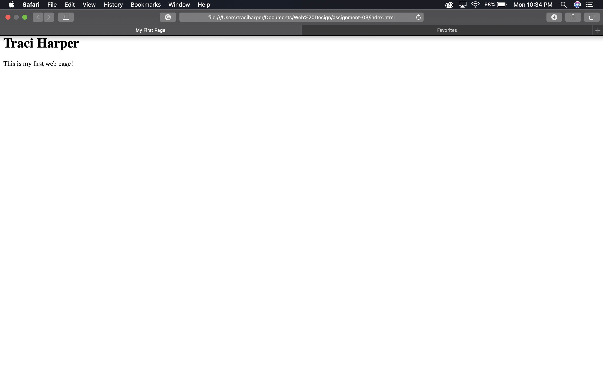

13. The browser sends a request over the network to a server, the server responds with web content, the browser interprets the returned content and displays it. I use Safari, Chrome, and Internet Explorer.
14. A markup language dictates the architecture of a page, with a focus on its text content. One commonly used is HTML.
15. 
