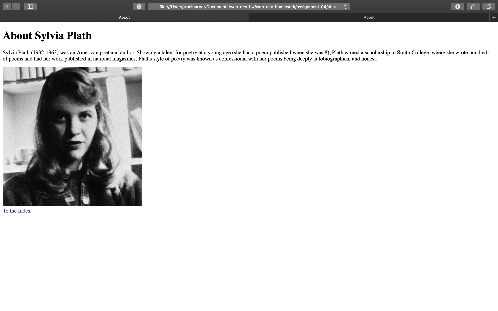

13. I looked at Google.com. The website has the old logo with the different colored Google letters and a TM symbol the font is completely different. The buttons below the search bar are different. There are blue hyperlinks instead of the clean formatting of today.
14. I learned a lot-it's interesting that any change you make on your computer can be pushed to the website. That makes everything very fast because its connect and updates and soon as you push it. I like the ease of that and I'm learning more about command line.
15. 
