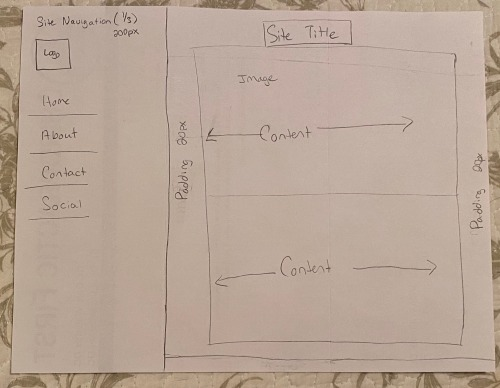

13. Boarders go around the outside of the element. Padding is the space between the inner content of the box and the box itself. Margin is the space between the border or outside of the element and the other elements.
14. 

15. Free Response: Summarize your work cycle for this assignment.
I sketched my website layout. I picked colors for the site, I found image placeholders and dummy text. I followed along with the tutorial. I set up the html and then formatted the css. I added padding, margins and borders. Created a circle placeholder for a logo and a navigation bar with links, adding hover effects to each. I could not get the social links to work correctly, so I'll need to work on that later on.
